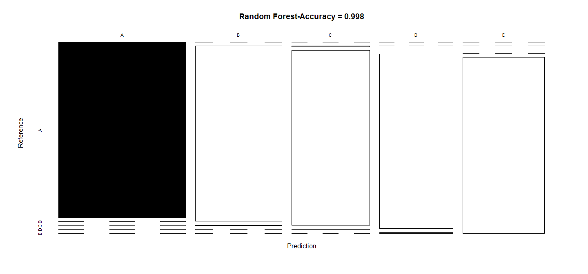
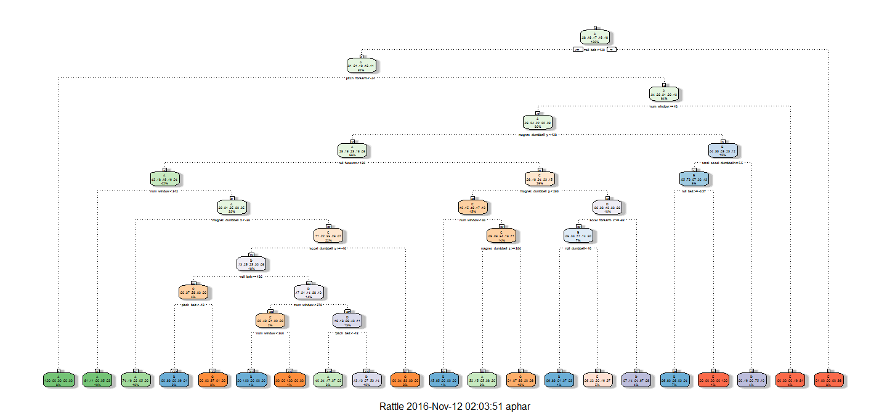
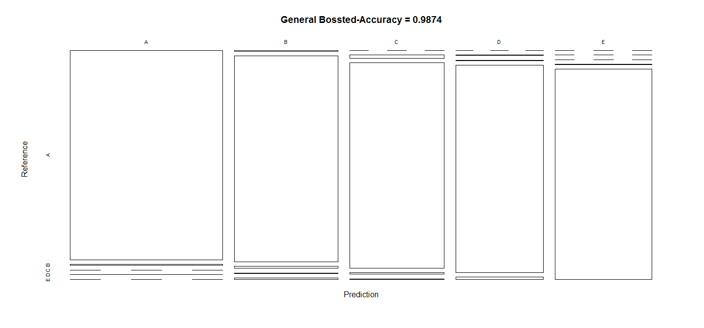

# Practical Machine Learning - Course Project
Srikanth Balaraman  
November 10, 2016  

# 1) Synopsis:

It is now possible to collect a large amount of data about personal activity relatively inexpensively using devices such as Jawbone Up, Nike FuelBand, and Fitbit. These type of devices are part of the quantified self movement - a group of enthusiasts who take measurements about themselves regularly to improve their health, to find patterns in their behavior, or because they are tech geeks. One thing that people regularly do is quantify how much of a particular activity they do, but they rarely quantify how well they do it. In this project, the goal is to use data from accelerometers on the belt, forearm, arm, and dumbell of 6 participants. They were asked to perform barbell lifts correctly and incorrectly in 5 different ways.The main goal of the project is to predict the manner in which 6 participants performed some exercise as described below. This is the "classe" variable in the training set. The machine learning algorithm described here is applied to the 20 test cases available in the test data and the predictions are submitted in appropriate format to the Course Project Prediction Quiz for automated grading.

# 2) Data Overview & Processing:

Six young health participants were asked to perform one set of 10 repetitions of the Unilateral Dumbbell Biceps Curl in five different fashions: exactly according to the specification (Class A), throwing the elbows to the front (Class B), lifting the dumbbell only halfway (Class C), lowering the dumbbell only halfway (Class D) and throwing the hips to the front (Class E).

### A) Load the required libraries


```r
library(knitr)
library(caret)
library(rpart)
library(rpart.plot)
library(rattle)
library(randomForest)
library(gbm)
library(corrplot)
```

### B) Read the dataset


```r
set.seed(4567)
trainurl <- "http://d396qusza40orc.cloudfront.net/predmachlearn/pml-training.csv"
testurl  <- "http://d396qusza40orc.cloudfront.net/predmachlearn/pml-testing.csv"

traindt <- read.csv(url(trainurl))
testdt <- read.csv(url(testurl))

# partition the training dataset 
inTrain  <- createDataPartition(traindt$classe, p=0.7, list=FALSE)
trainSet <- traindt[inTrain, ]
testSet  <- traindt[-inTrain, ]
```

### C) Analyse and clean the data
Remove the variables with nearly zero variance, that are mostly NA and also remove the id variables
      

```r
# remove variables with Nearly Zero Variance
nz <- nearZeroVar(trainSet)
trainSet <- trainSet[, -nz]
testSet  <- testSet[, -nz]

# remove variables that are mostly NA
mostlyNA    <- sapply(trainSet, function(x) mean(is.na(x))) > 0.95
trainSet <- trainSet[, mostlyNA==FALSE]
testSet  <- testSet[, mostlyNA==FALSE]

# remove identification only variables (columns 1 to 5)
trainSet <- trainSet[, -(1:5)]
testSet  <- testSet[, -(1:5)]
dim(trainSet)
```

```
## [1] 13737    54
```

# 3) Prediction Models:

Three models were used and a confusion matrix was plotted to visualize the accuracy of the models

### I) Random Forest Method: 


```r
set.seed(4567)
cntlrf <- trainControl(method="cv", number=3, verboseIter=FALSE)
modrf <- train(classe ~ ., data=trainSet, method="rf",trControl=cntlrf)
modrf$finalModel
```

```
## 
## Call:
##  randomForest(x = x, y = y, mtry = param$mtry) 
##                Type of random forest: classification
##                      Number of trees: 500
## No. of variables tried at each split: 27
## 
##         OOB estimate of  error rate: 0.16%
## Confusion matrix:
##      A    B    C    D    E  class.error
## A 3904    1    0    0    1 0.0005120328
## B    5 2651    1    1    0 0.0026335591
## C    0    3 2392    1    0 0.0016694491
## D    0    0    7 2245    0 0.0031083481
## E    0    0    0    2 2523 0.0007920792
```

```r
# prediction on Test dataset
predrf <- predict(modrf, newdata=testSet)
confmodrf <- confusionMatrix(predrf, testSet$classe)
confmodrf
```

```
## Confusion Matrix and Statistics
## 
##           Reference
## Prediction    A    B    C    D    E
##          A 1674    0    0    0    0
##          B    0 1136    3    0    0
##          C    0    3 1022    1    0
##          D    0    0    1  963    4
##          E    0    0    0    0 1078
## 
## Overall Statistics
##                                           
##                Accuracy : 0.998           
##                  95% CI : (0.9964, 0.9989)
##     No Information Rate : 0.2845          
##     P-Value [Acc > NIR] : < 2.2e-16       
##                                           
##                   Kappa : 0.9974          
##  Mcnemar's Test P-Value : NA              
## 
## Statistics by Class:
## 
##                      Class: A Class: B Class: C Class: D Class: E
## Sensitivity            1.0000   0.9974   0.9961   0.9990   0.9963
## Specificity            1.0000   0.9994   0.9992   0.9990   1.0000
## Pos Pred Value         1.0000   0.9974   0.9961   0.9948   1.0000
## Neg Pred Value         1.0000   0.9994   0.9992   0.9998   0.9992
## Prevalence             0.2845   0.1935   0.1743   0.1638   0.1839
## Detection Rate         0.2845   0.1930   0.1737   0.1636   0.1832
## Detection Prevalence   0.2845   0.1935   0.1743   0.1645   0.1832
## Balanced Accuracy      1.0000   0.9984   0.9976   0.9990   0.9982
```

```r
# plot results
plot(confmodrf$table, col = confmodrf$byClass, main = paste("Random Forest-Accuracy =",round(confmodrf$overall['Accuracy'], 4)))
```

<!-- -->

### II) Decision Trees Method


```r
set.seed(4567)
moddt <- rpart(classe ~ ., data=trainSet, method="class")
fancyRpartPlot(moddt)
```

<!-- -->

```r
# prediction on Test dataset
preddt <- predict(moddt, newdata=testSet, type="class")
confmoddt <- confusionMatrix(preddt, testSet$classe)
confmoddt
```

```
## Confusion Matrix and Statistics
## 
##           Reference
## Prediction    A    B    C    D    E
##          A 1503  238   53   81   51
##          B   47  627   31   27   19
##          C    9   79  810  128   70
##          D   92  137   69  622  135
##          E   23   58   63  106  807
## 
## Overall Statistics
##                                          
##                Accuracy : 0.7424         
##                  95% CI : (0.731, 0.7535)
##     No Information Rate : 0.2845         
##     P-Value [Acc > NIR] : < 2.2e-16      
##                                          
##                   Kappa : 0.6728         
##  Mcnemar's Test P-Value : < 2.2e-16      
## 
## Statistics by Class:
## 
##                      Class: A Class: B Class: C Class: D Class: E
## Sensitivity            0.8978   0.5505   0.7895   0.6452   0.7458
## Specificity            0.8995   0.9739   0.9411   0.9120   0.9479
## Pos Pred Value         0.7804   0.8349   0.7391   0.5896   0.7635
## Neg Pred Value         0.9568   0.9003   0.9549   0.9292   0.9430
## Prevalence             0.2845   0.1935   0.1743   0.1638   0.1839
## Detection Rate         0.2554   0.1065   0.1376   0.1057   0.1371
## Detection Prevalence   0.3273   0.1276   0.1862   0.1793   0.1796
## Balanced Accuracy      0.8987   0.7622   0.8653   0.7786   0.8469
```

```r
# plot results
plot(confmoddt$table, col = confmoddt$byClass, main = paste("Decision Tree-Accuracy =",round(confmoddt$overall['Accuracy'], 4)))
```

<!-- -->

### III) Generalized Boosted Method 


```r
set.seed(4567)
cntlgb <- trainControl(method = "repeatedcv", number = 5, repeats = 1)
modgb  <- train(classe ~ ., data=trainSet, method = "gbm",trControl = cntlgb, verbose = FALSE)
```

```
## Loading required package: plyr
```

```r
modgb$finalModel
```

```
## A gradient boosted model with multinomial loss function.
## 150 iterations were performed.
## There were 53 predictors of which 43 had non-zero influence.
```

```r
# prediction on Test dataset
predgb <- predict(modgb, newdata=testSet)
confmodgb <- confusionMatrix(predgb, testSet$classe)
confmodgb
```

```
## Confusion Matrix and Statistics
## 
##           Reference
## Prediction    A    B    C    D    E
##          A 1670    8    0    1    0
##          B    4 1114   11    3    6
##          C    0   15 1013    8    2
##          D    0    2    2  950   10
##          E    0    0    0    2 1064
## 
## Overall Statistics
##                                           
##                Accuracy : 0.9874          
##                  95% CI : (0.9842, 0.9901)
##     No Information Rate : 0.2845          
##     P-Value [Acc > NIR] : < 2.2e-16       
##                                           
##                   Kappa : 0.9841          
##  Mcnemar's Test P-Value : NA              
## 
## Statistics by Class:
## 
##                      Class: A Class: B Class: C Class: D Class: E
## Sensitivity            0.9976   0.9781   0.9873   0.9855   0.9834
## Specificity            0.9979   0.9949   0.9949   0.9972   0.9996
## Pos Pred Value         0.9946   0.9789   0.9759   0.9855   0.9981
## Neg Pred Value         0.9990   0.9947   0.9973   0.9972   0.9963
## Prevalence             0.2845   0.1935   0.1743   0.1638   0.1839
## Detection Rate         0.2838   0.1893   0.1721   0.1614   0.1808
## Detection Prevalence   0.2853   0.1934   0.1764   0.1638   0.1811
## Balanced Accuracy      0.9977   0.9865   0.9911   0.9913   0.9915
```

```r
# plot results
plot(confmodgb$table, col = confmodgb$byClass, main = paste("General Bossted-Accuracy =",round(confmodgb$overall['Accuracy'], 4)))
```

<!-- -->


# 4) Results:

Random Forest model is the most accurate and will be applied to predict the 20 quiz results (testing dataset) as shown below.


```r
predfin <- predict(modrf, newdata=testdt)
predfin
```

```
##  [1] B A B A A E D B A A B C B A E E A B B B
## Levels: A B C D E
```
